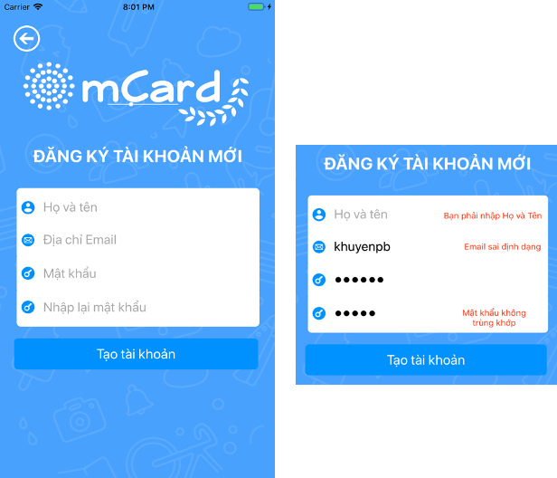
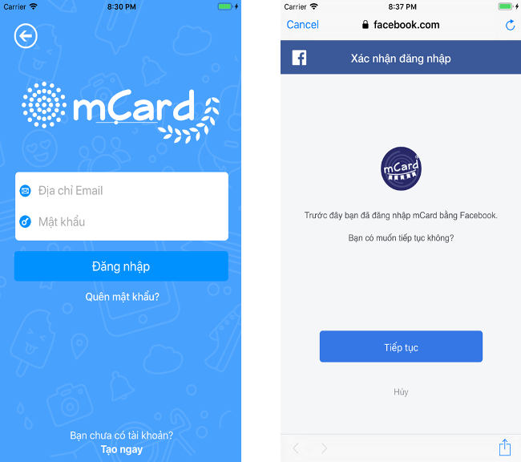
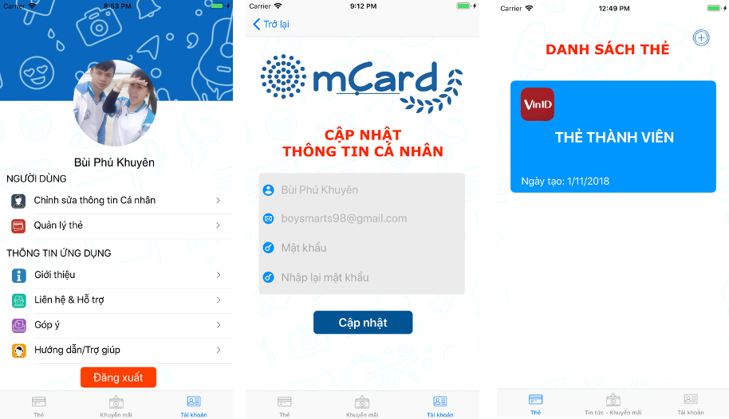
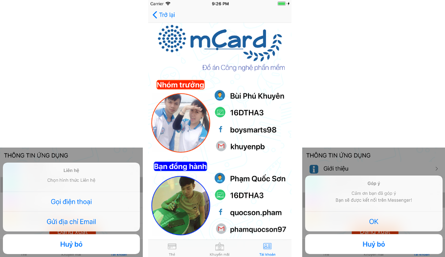
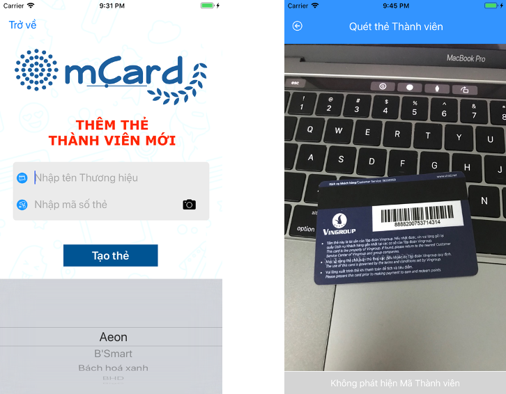

# Swift Language - Ứng dụng Quản lý Thẻ thành viên mCard

   
   Đây là ứng dụng Mobile đầu tiên mình viết - phục vụ cho đồ án môn học "Công nghệ phần mềm"

Công cụ, Ngôn ngữ sử dụng:

-   Swift 5 (XCode 10)

-   Firebase (Authentication & Realtime Database)

-   Wordpress

## **Màn hình Khởi động**

 Đây là giao diện màn hình khi khởi động ứng dụng trước khi vào giao diện chính của phần mềm. 

## **Giao diện Chính**

Sau khi khởi động ứng dụng, màn hình sẽ hiện những thông tin sau:

-	Logo của ứng dụng
-	Giới thiệu về ứng dụng mCard (sử dụng ScrollView + Page Control)
-	Các Button Action: 

> Đăng nhập truyền thống -
> Đăng nhập bằng Liên kết với Mạng xã hội (Facebook) 
> - Đăng ký thành viên

## **Giao diện Đăng ký thành viên**

   Để sử dụng các chức năng của ứng dụng, yêu cầu bạn phải Đăng ký tài khoản và có các yêu cầu sau:
   
-   **TextField Họ và tên** * : Nhập tên bất kỳ
-   **TextField Địa chỉ Email** * : Nhập đúng định dạng Email: _ @ _
-   **TextField Mật khẩu** * : Nhập mật khẩu tối thiểu 6 ký tự
-   **TextField Nhập lại Mật khẩu** * : Nhập lại mật khẩu phải trùng khớp
-   **Button Action:** Tạo tài khoản
Lưu ý: Các mục (*) là yêu cầu bắt buộc nhập. Giả sử người dùng không hợp lệ sẽ có những ràng buộc và thông báo lỗi như sau:

## **Giao diện Đăng nhập**

  Có 2 cách đăng nhập: 

-	Đăng nhập truyền thống (yêu cầu Địa chỉ Email và Mật khẩu).
-	Đăng nhập Mạng xã hội (yêu cầu xác thực từ bên thứ 3).

## **Giao diện Khôi phục mật khẩu**

Trong trường hợp quên mật khẩu, để lấy lại mật khẩu ứng dụng yêu cầu dùng địa chỉ Email để khôi phục mật khẩu với điều kiện Email phải tồn tại trên hệ thống.

## **Giao diện Thông tin tài khoản**

  Sau khi đăng nhập thành công, tại Phần thông tin tài khoản (TabBar 3) sẽ hiển thị thông tin Tài khoản cùng những chức năng như:
  
-	Về phía người dùng: Chỉnh sửa thông tin cá nhân, Quản lý thẻ.
-	Về thông tin ứng dụng: Giới thiệu, Liên hệ & Hỗ trợ, Góp ý, Trợ giúp.

## **Giao diện Thêm thẻ thành viên mới**

Để thêm thành viên mới, bạn cần Nhập tên thương hiệu có sẵn như hình dưới. Đồng thời nhập Mã vạch của thẻ để ứng dụng xử lý.

## **Giao diện Xem thẻ Thành viên đã được thêm**

Sau khi thêm thẻ thành viên vào ứng dụng, bạn có thể xem thông tin của thẻ bao gồm các thông tin sau:

-	Tên thương hiệu thẻ thành viên
-	Mã vạch của thẻ thành viên
-	Xem các thông tin khác của thẻ từ trang web của thương hiệu

## **Giao diện xem Tin tức và Khuyến mãi**

Với chức năng xem Tin tức và Khuyến mãi từ các Thương hiệu thẻ được lấy từ Website mCard.site (sử dụng WordPress)

